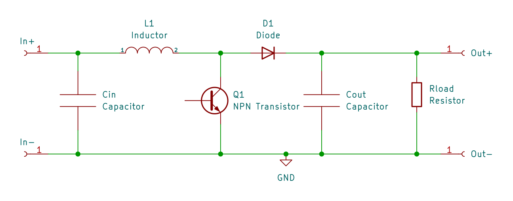

* TOC
{:toc}

# Introduction
The first converter we'll build is a simple boost converter:

This is a good circuit to start since it is easy to drive the mosfet (no high side driving) and it's fun to get a higher voltage than the input. 

# Individual Components
First let's discuss the individual components:

## Capacitor
A capacitor is an electronic component that stores electric charge. It is made up of two conductive plates separated by an insulating material, or dielectric. When a voltage is applied across the plates, electrons collect on one of the plates and are removed from the other, creating an electric field between the plates. 

The amount of current that flows for a given rate of voltage change (volts per second) is determined by its capacitance, which is measured in farads.

The capacitors act as a filter, smoothing out the input and output voltage by storing and releasing charge as needed. When the voltage rises, the capacitor charges, helping to maintain a steady voltage. Conversely, when the output voltage drops, the capacitor discharges, providing additional current to help maintain the voltage.

## Inductor
An inductor is a passive electrical component that stores energy in a magnetic field when a current flows through it. It consists of a coil of wire, typically wrapped around a core made of a magnetic material such as iron.

When a voltage is applied to an inductor, the current through the inductor begins to change (increase or decrease). The rate at which it changes (amperes per second) for a given voltage is determined by it's inductance, which is measured in henrys.

## Resistor
A resistor is a passive electrical component that is used to limit the flow of current. Resistors are made of materials that resist the flow of electrical current, typically by converting some of the electrical energy into heat.

Resistors come in a variety of shapes and sizes, with the most common type being a cylindrical component with wire leads. The resistance of a resistor is measured in ohms, with higher ohm values indicating a greater resistance to the flow of current.

When a voltage is applied to a resistor a current directly proportional to the voltage flows through the resistor.

## Diode
A diode is an electronic component that allows current to flow in only one direction, effectively acting as a one-way valve for electrical current. In other words, a diode allows current to flow freely in one direction (known as the forward direction), while blocking current from flowing in the opposite direction (known as the reverse direction).

The basic structure of a diode consists of a piece of semiconductor material (usually made of silicon or germanium) with two regions, known as the P-type and N-type regions.

## NPN Transistor
An NPN transistor is a three-terminal electronic component that is widely used in electronic circuits as an amplifier or a switch. It is made up of three layers of semiconductor material, with a layer of p-type material sandwiched between two layers of n-type material. The three terminals of an NPN transistor are called the emitter, the base, and the collector.

When a small current is applied to the base of the transistor, it allows current to flow from the collector to the emitter, effectively turning the switch on. Conversely, when no current is applied to the base, the transistor blocks current flow, turning the switch off.

# Operation of the Boost Converter
Now that the different components are introduced, we can understand how the converter works. To keep things simple, the first converter will operate in discontinuous conduction mode (DCM). You don't have to understand this yet, but be aware that there is also a continous conduction mode (CCM), which is harder to control.

The converter goes through several different phases during each switching cycle. These phases are:

1. **Charging Phase:** During this phase, the transistor is turned on and the current through the inductor increases, charging it up with energy from the input. At the same time, the output capacitor discharges to provide current to the load.

1. **Discharge Phase:** Once the desired current has been reached, the switch is turned off and the inductor begins to discharge its energy through the diode and into the output capacitor and the load. During this phase, the inductor current decreases until it reaches zero.

1. **Idle Phase:** Once the inductor current reaches zero, all the load current is provided by the output capacitor. The phase ends when the next charging phase is started by the controller.

# Building the Converter
Now that we have a basic understanding of the converter, we can start designing and building one. Unlike for other circuits, there is a myriad of tradeoffs involved in the design. But don't worry, this section will guide you to a working converter.

To make things easy, the following tool will do all the math for you. Read below on how to use it.

 foo 

First you'll need an inductor. 

TODO: write about inductors, and how to measure their inductance

