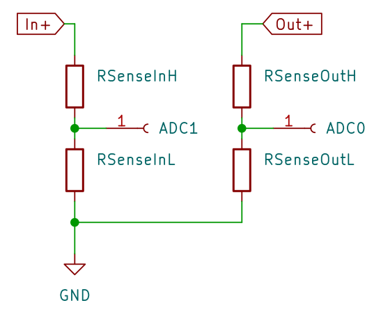
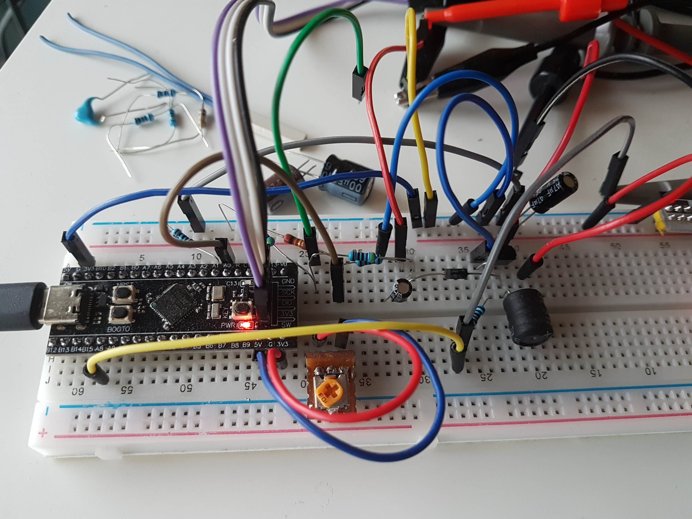
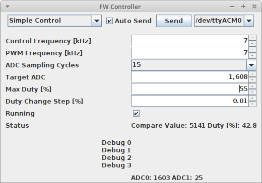
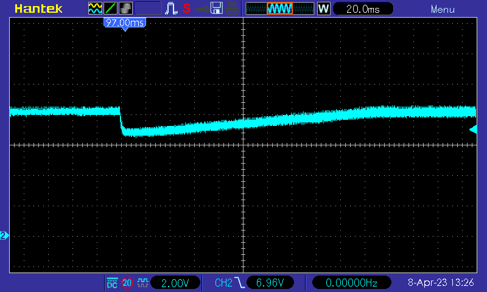
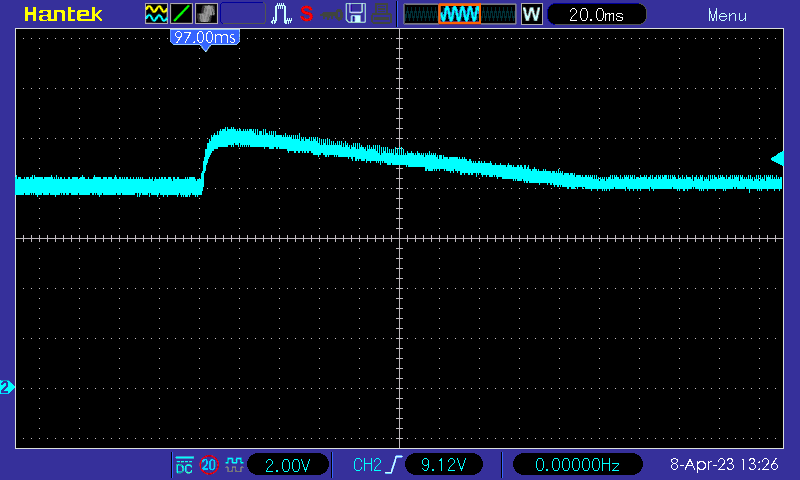
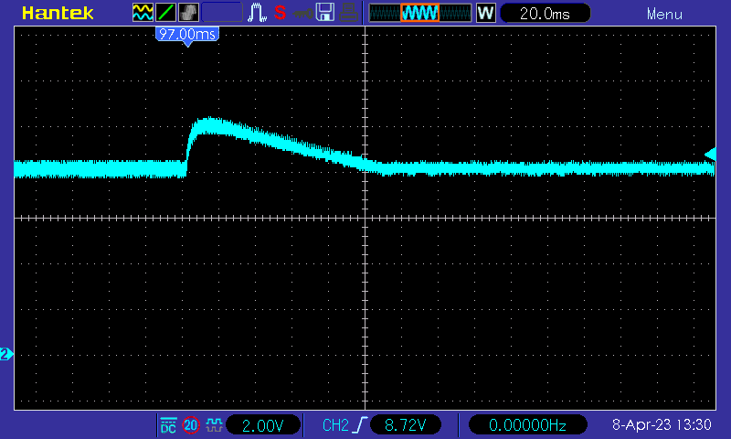
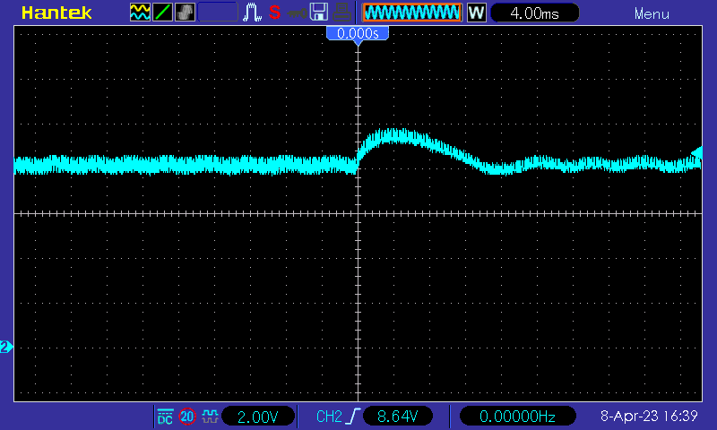
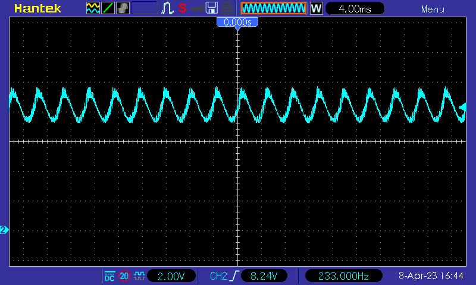

* TOC
{:toc}

# Introduction
In our previous project, we successfully built a [simple boost converter](../010_FirstConverter/FirstConverter.html) and manually set the frequency and duty cycle of the PWM signal. Any change to the input voltage, load or target voltage requires manual adjustment of the duty cycle. Of course, we would like the microcontroller to do these adjustments automatically. This part of the converter is called the control loop. Building control loops is a complex topic, but we'll start with a simple algorithm.

# The Algorithm
Our algorithm is based on a feedback control loop. The microcontroller measures the output voltage using an ADC and compares it with the desired target voltage. If the output voltage is below the target, we slightly increase the duty cycle. If it is above the target, we reduce the duty cycle. This process is repeated at a predefined control loop frequency. To prevent overloading and damaging the components, we also define a maximum duty cycle.

# Measuring the Output Voltage
To implement the feedback control loop, we need to measure the output voltage using an ADC. An ADC, or Analog to Digital Converter, is a device built into the microcontroller that converts an analog voltage signal into a digital value.

The ADC used in the STM32F401 microcontroller is a SAR ADC. It has it's own clock frequency and works by first charging a capacitor to the input voltage (the acquisition or sample phase) and then measuring that voltage (conversion phase). As the switching introduces some noise, it is important to do the measurement at a time when no switching occurs. In our first controllers the end of the acquisition phase is be placed just before switching off the transistor. Details of the timing can be found in the datasheet.

The voltage the ADC accepts is limited by the analog reference voltage. Some modules have a dedicated analog reference voltage pin, others just tie the reference voltage to the supply voltage, which is 3.3V in our case. Typically, the analog reference voltage cannot exceed the supply voltage. The output voltage of the boost converter typically far exceeds those 3.3V, thus we have to scale the voltage down using a voltage divider. The voltage divider consists of two resistors connected in series. The output voltage is taken from the node between the two resistors, and this voltage is proportional to the output voltage of the converter.

The resulting voltage only depends on the ratio of the two resistors, so two very large or two very small resistors produce the same output voltage. If the resistors are small, a large current flows though them and they convert a lot of power to heat. If we choose large resistors, we solve the power issue, but might introduce another one: the ADC has to charge the capacitor during the sample phase. If the resistors are too large, this will affect our measurement, as sample phase ends before the capacitor is fully charged. 

The tool below allows you to calculate and check the ADC setup, include the values for the voltage divider. The ADC frequency is configured in STM32CubeMX. Refer to the ADC configuration and to the clock configuration. In our case it's 21 MHz. The ADC capacitance and sampling switch resistance can be found in the datasheet, and is 7 pF respectively 7 kOhm for the STM32F401. The sampling time can be set to the following values [ADC cycles]: 3, 15, 28, 56, 84, 112, 144, 480.

# Timer Configuration
The STM32F401 contains multiple timers. Each timer has a counter register (typically 16 bit wide) which is incremented by one at a certain frequency. In addition, there is a reset register. When the counter reaches the value of the reset register, the counter is set back to zero.

Then there are multiple channels. Each channel has a capture/compare (CCR) register and can be configured separately in a specific mode. One mode that is of particular interest for us is the Pulse Width Modulation (PWM) mode. In this mode, a pin is set to high whenever the counter is reset. When the counter reaches the value of the channel's CCR register, the pin is set to low. This is how we produced the signal to control the transistor.

The timers work independent of the any code execution, thus allowing for very precise and consistent control of the output pin. Of course, the code of the microcontroller can influence the operation of the timer by modifying various control registers and by changing the value of the reset or CCR registers. 

We also use a timer to start the ADC conversion. This way, the timing of the ADC sampling phase can be synchronized to the switching. In addition we use the Direct Memory Access (DMA) feature to automatically copy the result of the ADC to a memory buffer after conversion. This also happens without using the CPU.

And finally, we use a completely separate timer to trigger the control loop via interrupt. This gives us the flexibility to run the control loop at a lower frequency than the switching frequency, in case the calculations in the control loop would take longer than a switching cycle. It also makes control algorithms with varying switching frequencies far easier to implement.

# Building and Testing the Circuit
In order to test a load change, split the load resistor into two resistors with half the value each. Now you can the short one of the resistors (or remove the short) to cause a load change.

Here is a picture of my setup. The green wire is used to short one of the load resistors.

Now, start the firmware controller, switch to `Simple Control` mode and configure it. Use the values from the previous converter. The `Max Duty` limits the duty cycle to protect the circuit, in case something goes wrong. Start with a small `Duty Change Step` to avoid oscillations.

Now remove the wire from the load resistor:

Notice the reduced duty cycle to compensate for the increased load resistance (less current required for the same voltage). The connected multimeter constantly shows 8V.

The following two oscilloscope shots show the shorting and un-shorting one of the load resistors. Notice that the voltage fluctuates between 6V and 10V, and takes about 0.2 seconds to stabilize. For the output capacitor I used a 10uF capacitor, which is quite small.

Of course, we can improve by increasing the `Duty Change Step` to 0.02:

Now our settle time is reduced to 0.1s. Pushing this even further with a `Duty Change Step` of 0.2:

Now the settle time has been reduced to about 14ms (time scale of the scope changed), or 0.014s. But notice the small oscillations after settling! If we increase the step size to 4:

Now we clearly get some oscillations. This shows a typical tradeoff for control loops: As the feedback gets faster, the regulation becomes snappier, but after a certain point we run into oscillations.