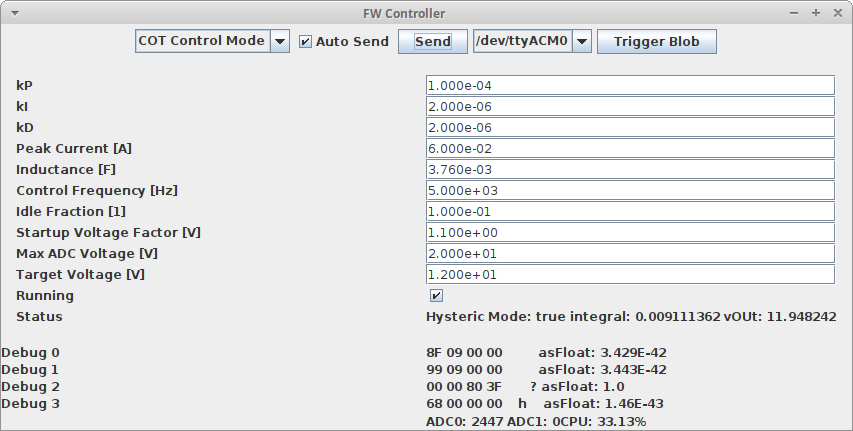
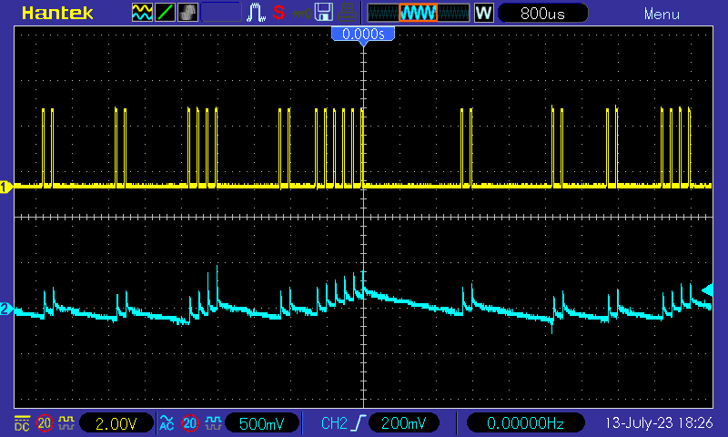
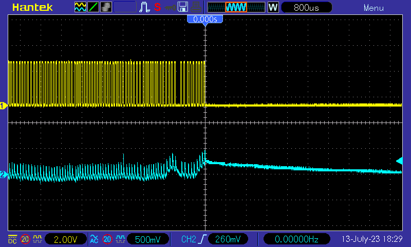
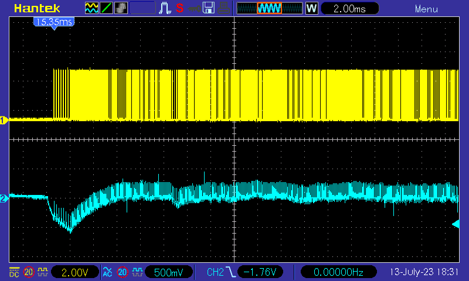
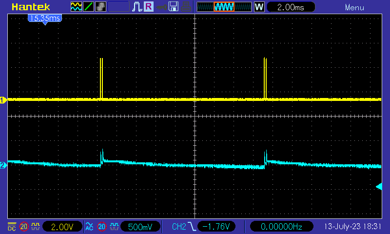
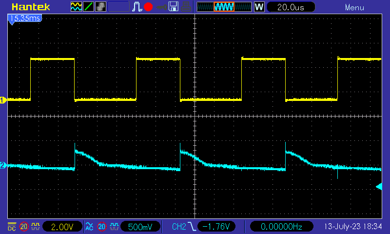

* TOC
{:toc}

# Introduction

Thus far we have been working with fixed switching frequencies. This has a big downside when the converter is operating at light load. Every time the transistor or mosfet is switched on or off, some power is lost and dissipated as heat. For light loads the duty cycles become very small. In every cycle very little current flows through the inductor, but the switching losses are still present.

This issue can be addressed by keeping the on-time of the switch constant and reducing the switching frequency instead (Constant On Time, COT). This reduces the duty cycle and the switching losses at the same time. To allow the converter to operate over a range of input voltages $$V_\text{in}$$, we can calculate the on time based on a desired peak inductor current $$\hat I$$:

$$ t_\text{on}=\frac{L\hat I}{V_\text{in}}$$

The power converted in COT mode is proportional to the cycle frequency. Thus, by changing the PWM frequency we can control the output voltage.

If the load drops to a very low level, the frequency becomes also very low. It is not practical to use a PID controller if one period lasts multiple seconds. Therefore, below a minimum frequency we switch to a mode called cycle skipping. This is essentially a form of hysteric control: The PWM frequency kept fixed. Whenever the voltage drops below the target voltage, the switching PWM signal is enabled. If it rises above the target voltage, the PWM signal is disabled.

# COT

In the COT mode we use a PID controller to adjust the PWM frequency to reach the target voltage at the output. A PID controller works best for linear system. That means, at all operation points, the same change of the controller output should have the same effect on the converter. In our case, we choose to control the output current $$I_\text{out}$$. For a fixed target voltage, this is equivalent to controlling the target power, and for an ohmic load it is also equivalent to controlling the output voltage. Also, the output (and load) capacitance is typically fixed. Thus the response time to a current change is independent of the output voltage.

Given the output current $$I_\text{out}$$, we can derive the PWM period $$T$$. First, we can calculate the time $$t_\text{fall}$$ for the inductor current to reach zero when the switch is turned off:

$$ t_\text{fall}=\frac{L\hat I}{V_\text{out}-V_\text{in}}$$

The average current flowing to the output during this time is $$\hat{I}/2$$. The rest of the PWM period $$T$$ there is no current flowing to the output. The average current flowing is therefore

$$ I_\text{out}=\frac{\hat{I}}{2} * \frac{t_\text{fall}}{T} $$

Solving for $$T$$ leads to

$$ T=\frac{\hat{I}}{2} * \frac{t_\text{fall}}{I_\text{out}} $$

$$ T=\frac{L\hat{I}^2}{2I_\text{out}(V_\text{out}-V_\text{in})} $$

Regarding the maximum output current, we know that

$$ T_\text{min}=\frac{t_\text{on}+t_\text{fall}}{1-\alpha} $$

with $$\alpha>1$$ as the idle fraction to make sure the current actually reaches 0, for example $$\alpha=0.1=10\%$$

Using the formula from above:

$$ I_\text{out max}=\frac{\hat{I}}{2} * \frac{t_\text{fall}}{ T\_\text{min}} $$

Using the following tool, you can calculate the performance envelope of a converter: 

# Cycle Skipping
To switch between COT and Cycle Skipping the control frequency used as reference. If the PWM frequency is above the control frequency, a PID controller makes most sense. If the PWM frequency is below the control frequency, the easiest way to regulate is to just enable the PWM signal as soon as the voltage is below the target voltage.

The switch from COT to Cycle Skipping happens as soon as the switching frequency reaches half the control frequency. The PWM frequency in Cycle Skipping is set to the control frequency. Therefore after the switch, the PWM signal has to be enabled about half the time to keep produce the output current at the switching point. This gives some room to avoid oscillations between the two modes.

Going back from Cycle Skipping to COT happens as soon as the PWM signal is enabled for at least three cycles and the output voltage drops more than two standard deviations below the target voltage.

# Handling Low Output Voltages
When the converter starts, the output voltage matches the input voltage and the fall time is theoretically infinite. To avoid that, the output voltage used for the calculations is at least 1.1 times the input voltage.

# Experimental Results
The following shows the control application at a steady state with a 12k resistor as load (1mA):

and the corresponding wave form:

Switching the load between idle and a 2k resistor (6mA):

The idle wave form:

Situation with 2k load:

